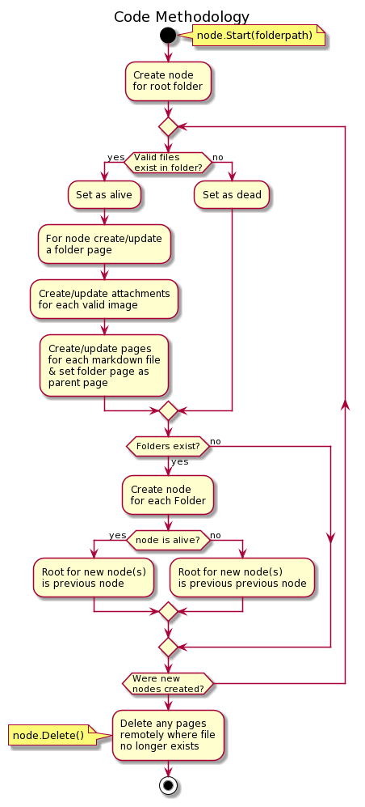

# Markdown to Confluence Action
[PLEASE READ THIS GUIDE ON HOW TO USE THIS TOOL CORRECTLY](https://github.com/xiatechs/markdown-to-confluence/blob/master/GUIDE.md)

- This Action will crawl through a repository on github and create a tree of pages on confluence for all markdown / images:



## When this action is run:

1) A confluence page will be created containing the markdown documentation of a repository
2) Any new markdown pages in the repository will be uploaded or updated
3) A plaintext markup page will be generated and uploaded for code in pages with markdown
4) Old markdown pages online that have been removed in the repository will be deleted

## Features:

1) Folders with no content will be skipped to prevent a long chain of child pages & general confusion.
2) Images will be displayed in markdown pages.

## Important:

1) This creates a mirror image of documentation in github in confluence - you can add comments to pages but any edits to the pages in confluence will be deleted when the page is next updated. So don't bother editing these pages in confluence!
2) There must be at least one markdown file in the root repository i.e README.md
3) Markdown title taken by the name of the markdown file.
4) Alternatively, title can be grabbed via TOML frontmatter. For more information on this, see the next section.

## TOML frontmatter:
```
Frontmatter is essentially a location where you can add metadata to your markdown.

Here is an example of TOML frontmatter including the title.
+++
title = "example title goes here"
+++

For this to function, just place this frontmatter at the start of your markdown.
TOML frontmatter can include many more properties. For more information on TOML 
please visit this link here --> https://gohugo.io/content-management/front-matter/

At the moment this application only makes use of 'title' from frontmatter. Over time 
however this feature could grow. I guess it depends on the uptake of usage of frontmatter
against just using the # / ## titles.
```

## This action uses the [Confluence REST API](https://developer.atlassian.com/cloud/confluence/rest/intro/)

- Tom
