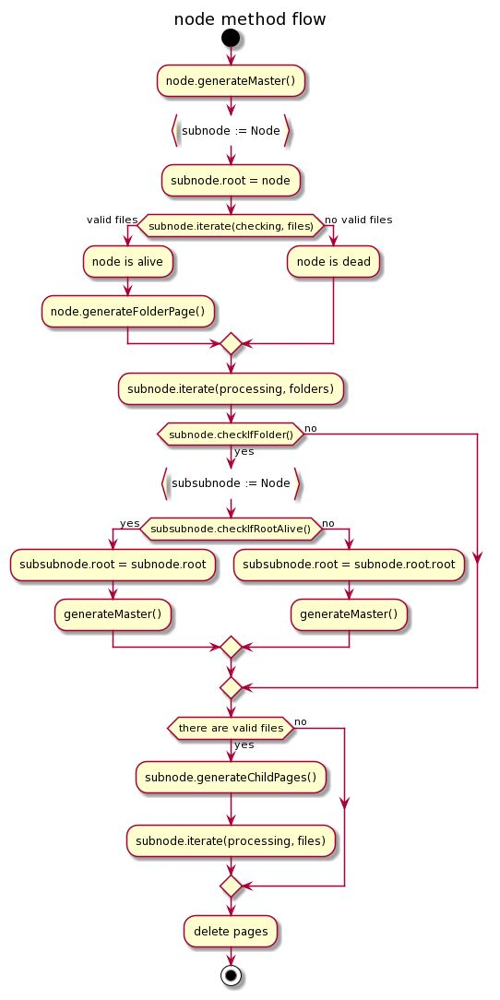

# markdown-to-confluence/node readme

```
    the node package is to enable 
    reading through a repo and 
    create a tree of content on confluence
```


### The package contains one exported struct:
```
// Node struct enables creation of a page tree
Node{}
```

### The package contains two exported methods:
```
Node{}

// this method begins the generation of a page tree in confluence for a repo project path.
// it ruturns a boolean confirming 'is projectPath a valid folder path'.
Start(projectPath string, client *confluence.APIClient) bool

// this method begins the deletion of pages in confluence that do not exist in
// local repository project path - it can be called after Instantiate method is called and returns true.
Delete()
```
